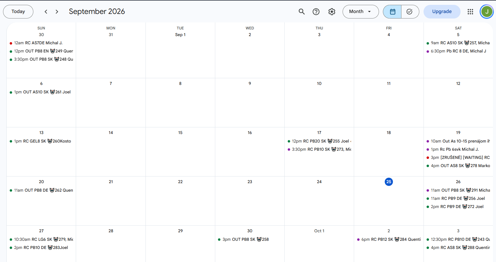
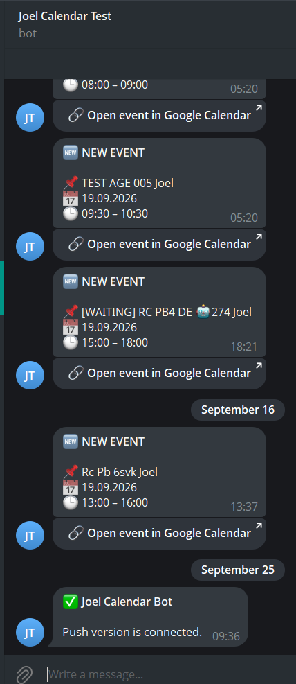
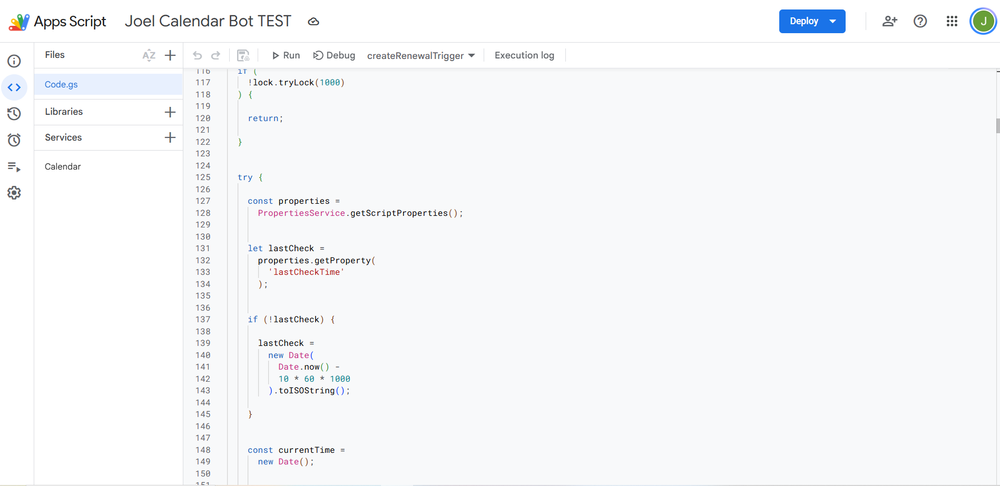

[](https://script.google.com/)
[](https://developer.mozilla.org/en-US/docs/Web/JavaScript)
[](https://calendar.google.com/)
[](https://telegram.org/)

# Google Calendar → Telegram Bot

A lightweight Google Apps Script automation that connects **Google Calendar** with **Telegram**.

Built to make calendar updates easier to notice by sending relevant events directly to Telegram.

> Made with love by **Olena Mykhailovska** for **Joel**.

---

## Overview

This project monitors a Google Calendar and sends Telegram notifications when new relevant calendar events appear.

The bot analyzes event information and determines whether an event should be reported based on its title, language, and number of players.

### Main workflow

```text
Google Calendar
       ↓
Google Apps Script
       ↓
Event analysis
       ↓
Telegram Bot
       ↓
Telegram notification
```

---

## Features

- Detects new Google Calendar events
- Sends notifications through Telegram
- Parses event titles and information
- Detects player counts
- Supports different event formats
- Adds **Joel** to relevant events
- Handles events with more than 15 players
- Filters irrelevant events
- Uses Google Calendar Push Notifications
- Automatically renews the calendar watch
- Uses HTML escaping for Telegram messages
- Normalizes text for more reliable parsing

---

## Example

When a relevant event is detected in Google Calendar, the bot processes the event and sends a notification to Telegram.

### Google Calendar



### Telegram

<p align="center">
  
</p>

---

## Project Structure

```text
google-calendar-telegram-bot/
│
├── Code.gs
├── README.md
└── .gitignore
```

The main application logic is contained in `Code.gs`.

---

## Technologies

| Technology          | Purpose                      |
| ------------------- | ---------------------------- |
| Google Apps Script  | Automation and backend logic |
| Google Calendar API | Calendar event monitoring    |
| Telegram Bot API    | Sending notifications        |
| JavaScript          | Event processing and parsing |

---

## How It Works

### 1. Calendar Monitoring

The script creates a Google Calendar push notification watch.

When the calendar changes, Google sends a notification to the Apps Script webhook.

### 2. Event Processing

The script retrieves updated calendar events and analyzes their titles.

It can recognize information such as:

- Event type
- Language
- Player count
- Names
- Event status

### 3. Event Filtering

The bot determines whether an event is relevant.

Events with more than 15 players can trigger special handling, including adding **Joel** to the event information and sending a Telegram notification.

### 4. Telegram Notification

When an event matches the required conditions, the bot sends a formatted notification to Telegram.

---

## Push Watch Renewal

Google Calendar push notification channels expire after a limited period.

The project includes an automatic renewal mechanism to keep the calendar connection active.

```text
createPushWatch()
       ↓
Google Calendar Watch
       ↓
Calendar changes
       ↓
Webhook
       ↓
Event processing
       ↓
Telegram
```

A time-based trigger runs `renewPushWatch()` to renew the connection.

---

## Security

Sensitive credentials are **not included in this repository**.

The following values must never be committed to a public repository:

- Telegram Bot Token
- Telegram Chat ID
- Google Calendar ID
- Private API credentials
- Webhook secrets

Configuration values should be stored securely in the Apps Script project and kept out of the public repository.

---

## Screenshots

### Google Calendar


### Telegram Bot

<p align="center">
  
</p>

### Google Apps Script



---

## Author

**Olena Mykhailovska**

Built as a personal automation project for **Joel**.

---

## License

This project is provided for personal and educational purposes.
